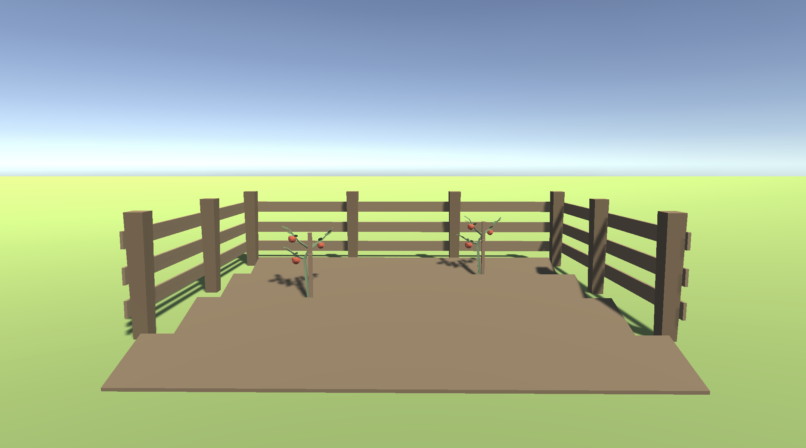
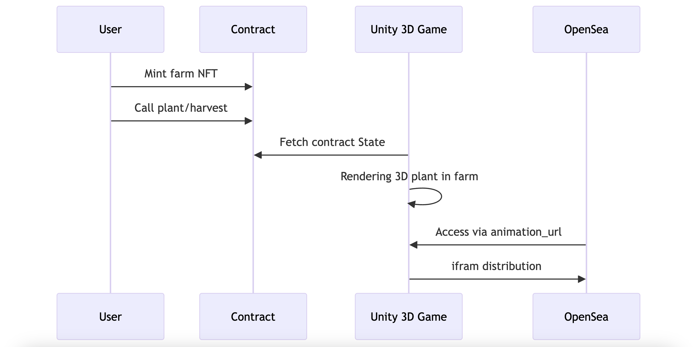
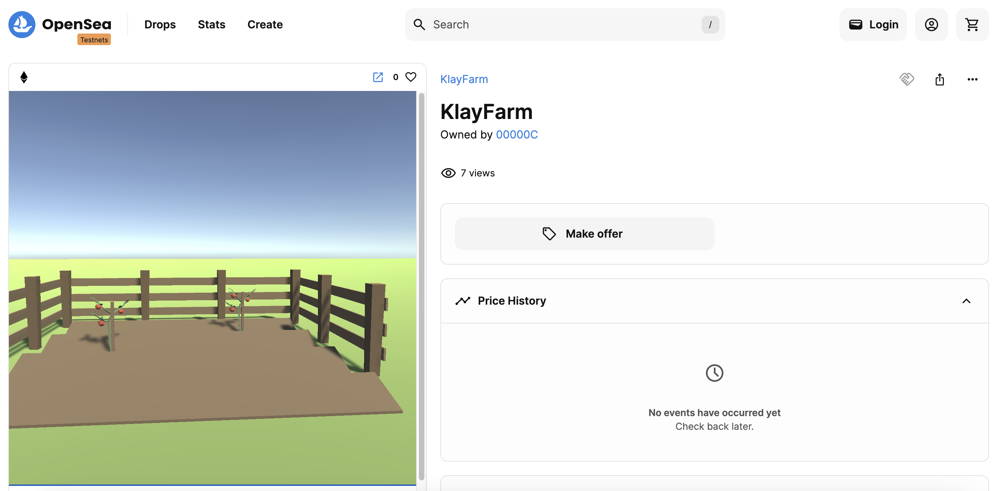
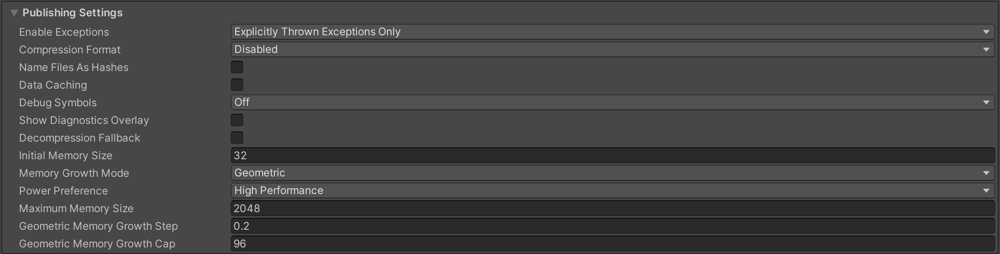

# KlayFarm

New Interactive On-Chain Game Distribution with Klaytn NFT.



## Demo Video

https://youtu.be/zs7R-ADUkMo

## Live APP (Viewer)

https://2023-klaymakers.vercel.app/api/items?id=26261747886964506387964269904227895253792649728833556614078948511907327676793

## Description

**KlayFarm** is an on-chain farming game where users can mint farm NFTs to plant and harvest crops. All transactions are executed on-chain, while a 3D interface visualizes the on-chain farm, enhancing user engagement and experience.

## How It Works



KlayFarm is a technical showcase combining Unity WebGL for 3D gaming with Klaytn blockchain's on-chain capabilities. It employs NFTs, deployed on the Klaytn testnet, to represent individual game elements. Each NFT's animation_url integrates with Unity WebGL, allowing the game to fetch and render real-time on-chain data using the NFT's token ID in OpenSea.

## Benefits

- **Innovative Game Distribution:** KlayFarm introduces a novel approach to game distribution using NFTs, where the client-side game simply renders the state of the on-chain contract.
- **True Metaverse Experience:** This methodology offers a unique way of experiencing the metaverse, where all users are connected to a consistent, shared state.
- **Web3-Native Approach:** By leveraging a fully on-chain model, KlayFarm aligns closely with the ethos of Web3, potentially attracting more developers to the Klaytn ecosystem.

## Reference

### Deployed Address

https://baobab.klaytnscope.com/account/0xCa12692fbF90F3551095f36BD2efcE9119330BBD?tabId=txList

## OpenSea integration

- This is actually the Goerli testnet NFT because uurrently OpenSea's Klaytn Testnet metadata fetch is not working well, so I deployed same contract on Goerli NFT for Demo. However the game is connected to the Klaytn test network. Please check the actual Unity game page for the Klaytn integration as well.

https://testnets.opensea.io/assets/goerli/0xB14572E709046C220AeC6D67195bd8Ee7908208f/26261747886964506387964269904227895253792649728833556614078948511907327676793



I spent most of times on OpenSea and Unity integration, so I keep the points.
I believe this implementation guide helps others to build game NFT with Unity and it will help Klaytn ecosystem grows.

### Build Setting

To display game on OpenSea, we need to set as the followings.



- Compression Format: Disabled
- Data Caching: False

### Restriction

Cursor lock does not work, so we disabled in the code.

```
// Cursor.lockState = CursorLockMode.Locked;
```
